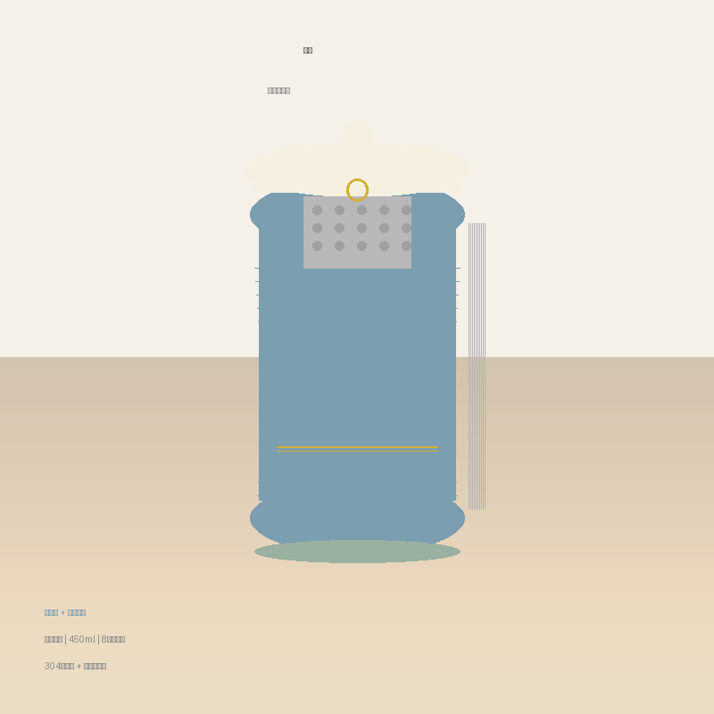

# 「暖时」桌面保温杯 — 设计方案

> 为怕冷办公族设计的时尚保温杯

---

## 产品定位

一款专为办公室久坐、怕冷体质设计的桌面保温杯。兼顾保温性能与时尚外观，让喝水变成每天的小确幸。

**目标用户**：办公室白领，怕冷体质，注重生活品质  
**使用场景**：办公桌面，长时间放置  
**核心卖点**：长效保温 + 时尚设计 + 茶漏仪式感

---

## 设计参数

| 参数 | 规格 |
|------|------|
| 产品名称 | 暖时 |
| 容量 | 450ml |
| 高度 | 约 16cm |
| 口径 | 约 8cm |
| 重量 | 约 380g（空杯） |
| 保温时长 | 8小时 ≥ 65°C |
| 材质 | 304不锈钢内胆 + 陶瓷釉涂层 |
| 外壳 | 304不锈钢 + 哑光喷漆 |

---

## 功能设计

### 1. 双层真空保温
- 304不锈钢真空层，有效隔热
- 内胆陶瓷釉涂层，不串味，易清洗
- 8小时保温 ≥ 65°C，早上泡的茶下午还是温的

### 2. 翻盖式杯盖
- 单手按压开启，办公时喝水方便
- 杯盖内侧可当小茶杯，适合品茗
- 硅胶密封圈，防尘防漏

### 3. 旋转式茶漏
- 304不锈钢细密滤网，0.5mm孔径
- 360°旋转取放，清洁方便
- 可选配：细密网（泡茶）/ 粗孔网（泡花果茶）

### 4. 微弧杯身
- 杯身中段微微内收，贴合手掌弧度
- 双手捧握时自然舒适，暖手效果佳
- 底部加宽设计，重心稳定不易倾倒
- 硅胶底垫，防滑静音

---

## 配色方案

### 主色：雾霾蓝
一种带灰调的蓝色，冷静中有温度，适合办公室环境，不张扬但有格调。

### 点缀色：奶油白 + 金色
- 杯盖：奶油白色
- 杯身装饰线条：金色细线（0.5mm）
- 茶漏拉手：金色圆环

### 整体风格
莫兰迪色调，低饱和度，时尚不刺眼。放在办公桌上既是实用品，也是一件小摆设。

---

## 尺寸示意图

```
        ┌─────┐
        │ 杯盖 │ ← 翻盖式，奶油白色
        │     │
        ├─────┤
        │     │
        │     │ ← 杯身：雾霾蓝哑光
        │     │    中段微弧内收
        │     │
        │     │ ← 金色细线装饰（距底部1/3处）
        │     │
        └─────┘ ← 加宽底部 + 硅胶底垫
      ───────────
```

---

## 材质清单

| 部件 | 材质 | 说明 |
|------|------|------|
| 内胆 | 304不锈钢 + 陶瓷釉 | 食品级，不串味 |
| 外壳 | 304不锈钢 | 哑光喷漆，防指纹 |
| 杯盖 | Tritan（共聚酯） | 耐高温，不含BPA |
| 密封圈 | 食品级硅胶 | 耐高温120°C |
| 茶漏 | 304不锈钢 | 细密滤网，0.5mm孔径 |
| 底垫 | 食品级硅胶 | 防滑静音 |

---

## 使用场景

### 早晨
泡一杯热茶，盖上杯盖，开始一天的工作。茶漏可以留在杯中，茶汤浓度自己控制。

### 上午
随时端起来喝一口，翻盖设计单手就能开。双手捧握时，杯身的微弧设计让手掌自然贴合，暖暖的。

### 下午
打开杯盖，茶还是温的。如果想换茶，旋转取出茶漏，清洗方便。

### 下班
收拾桌面，杯子底部硅胶垫不留痕迹，桌面干干净净。

---

## 设计亮点总结

1. **怕冷友好**：双层真空 + 微弧杯身，保温久、捧着暖
2. **时尚不张扬**：雾霾蓝 + 金色细线，办公桌上的小品味
3. **仪式感**：旋转茶漏 + 翻盖杯盖，泡茶喝茶都有腔调
4. **实用主义**：450ml大容量，8小时保温，减少接水次数

---

*设计完成：2026年7月3日*

## 设计草图



> 图中展示：雾霾蓝杯身 + 奶油白杯盖 + 金色细线装饰 + 旋转茶漏
